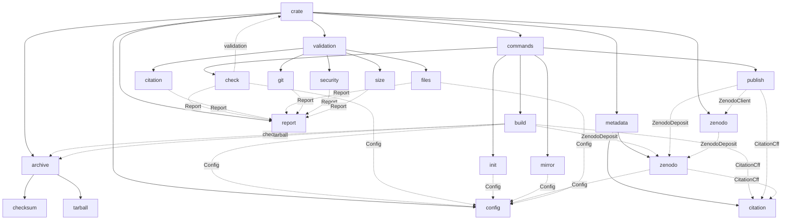
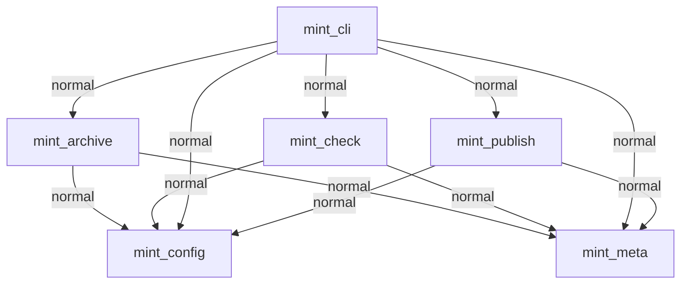

# Does a Disciplined Methodology Produce Measurably Better Code?
## release-scholar vs mint: A Controlled Comparison

> **What this document is:** A structured before/after comparison between
> `release-scholar` — a working Rust CLI built without a formal methodology — and
> `mint` — a ground-up rebuild of the same tool built using the Livery agentic
> engineering system. Both tools solve the same problem. The question is whether
> the methodology produces measurably different code.
>
> **How to read this document:** release-scholar values are pre-filled from baseline
> measurements taken on 2026-03-17, before a single line of mint code was written.
> mint values are filled in at v1.0, using the same tools and commands.
> The comparison is objective: same tool (Prism), same commands, same criteria.
>
> **The hypothesis:** A structured agentic methodology — with explicit design
> specifications, architectural decisions, TDD discipline, property-based tests,
> and continuous design-quality validation — produces code that is measurably deeper,
> better-tested, more maintainable, and more trustworthy than code produced by a
> capable developer using a standard (naive) agentic approach.

---

## The Naive Baseline: How release-scholar Was Built

`release-scholar` was built by an experienced developer using Claude Code without a
formal methodology. There was no `DESIGN.md`, no `ARCHITECTURE.md`, no TDD discipline,
no property tests, no design-quality gate. The development approach was representative
of how most developers currently use agentic coding tools: describe what you want,
review the output, iterate.

This is not a criticism of release-scholar — it works, it is used in production, and
it was built faster than mint will be. The point is not that the naive approach fails.
The point is to measure what it costs over time.

---

## The Methodology Baseline: How mint Is Being Built

`mint` is being built using the Livery agentic engineering system:
- Phase 0: `DESIGN.md` written before any code
- Phase 1: `ARCHITECTURE.md` with full API stubs and ADRs, audited against standards
- Phase 2: `CLAUDE.md`, skills, standards — all in place before session 1
- Phase 3: TDD (red/green/refactor with three passes), property tests mandatory
- Phase 4: `prism check --strict` gates every session
- The original `release-scholar` is the correctness oracle

---

## Section 1: Structural Comparison

### 1.1 Codebase Organisation

| Dimension | release-scholar | mint |
|---|---|---|
| Structure | Single flat crate, 5 internal module trees | Cargo workspace, 6 library crates + 1 binary |
| Binary crate contains business logic? | Yes — all logic in `src/` | No — `mint-cli` is dispatch only |
| Network boundary enforced structurally? | No — HTTP calls anywhere in codebase | Yes — only `mint-publish` may call APIs |
| Can core logic be tested without building the binary? | No — everything is coupled | Yes — library crates are independent |
| Can publish logic be tested without real credentials? | No — no trait abstraction | Yes — `ZenodoClient` trait + mocks |
| Dependency graph | All modules are siblings in one crate | Enforced one-directional DAG across 6 crates |

**Prism map — release-scholar** (`prism map --mermaid`):



> **Note on the map:** This is a single-crate module tree, not a workspace dependency
> graph. All modules are siblings inside one compiled unit. There is no structural
> boundary between `commands`, `validation`, `zenodo`, and `config` — any module can
> import any other. The dotted lines show actual imports, not enforced interfaces.

**Prism map — mint** (`prism map . --mermaid` — 2026-03-18 v1.0):



Internal module structure per crate:
- `mint-archive`: `checksum`, `git`, `tarball` modules + inline tests + proptests
- `mint-check`: `categories/citation`, `files`, `git`, `gitignore`, `joss`, `security`, `size` — each with inline tests; `security` + `gitignore` have inline proptests
- `mint-cli`: `subcommands/build`, `check`, `init`, `publish`, `status`
- `mint-meta`, `mint-config`, `mint-publish`: flat with inline tests + proptests

> **Note on the map:** This is a workspace dependency graph between 6 independent
> library crates plus 1 binary. Every edge is enforced by the Cargo dependency graph —
> a crate cannot import from a crate not listed in its `Cargo.toml`. The boundary
> between `mint-publish` and `mint-cli` is structural: HTTP calls can only exist in
> `mint-publish`. There is no equivalent boundary in release-scholar.

---

### 1.2 Module Depth (prism audit)

> A module depth ratio > 0.5 means the interface is nearly as complex as the
> implementation — a shallow module that hides little. Ousterhout's principle
> demands deep modules with ratios well below 0.5.

**release-scholar** (`prism audit` — 2026-03-17 baseline):

```
Prism Audit Report
========================================================================
Files scanned: 22  |  Total lines: 2466

  src                                      depth=0.45
    public items: 41  |  total items: 76  |  lines: 577
    functions:
      fmt                            cyclomatic=3   depth=1   cognitive=1
      merge_with_fallback            cyclomatic=4   depth=1   cognitive=3
      default_language               cyclomatic=1   depth=0   cognitive=0
      default_required_files         cyclomatic=1   depth=0   cognitive=0
      default_archive_dir            cyclomatic=1   depth=0   cognitive=0
      default                        cyclomatic=1   depth=0   cognitive=0
      pub load                       cyclomatic=5   depth=2   cognitive=6
      pub to_toml_string             cyclomatic=1   depth=0   cognitive=0
      pub global_config_path         cyclomatic=1   depth=1   cognitive=0
      load_global_config             cyclomatic=3   depth=1   cognitive=3
      main                           cyclomatic=6   depth=1   cognitive=2
      pub new                        cyclomatic=1   depth=0   cognitive=0
      pub add                        cyclomatic=1   depth=0   cognitive=0
      pub pass                       cyclomatic=1   depth=0   cognitive=0
      pub fail                       cyclomatic=1   depth=0   cognitive=0
      pub warn                       cyclomatic=1   depth=0   cognitive=0
      pub has_failures               cyclomatic=1   depth=1   cognitive=0
      pub print                      cyclomatic=6   depth=2   cognitive=6
      pub new                        cyclomatic=4   depth=1   cognitive=4
      pub create_deposition          cyclomatic=3   depth=1   cognitive=2
      pub upload_file                cyclomatic=4   depth=1   cognitive=3
      pub update_metadata            cyclomatic=3   depth=1   cognitive=2
      pub publish                    cyclomatic=3   depth=1   cognitive=2
      pub base_web_url               cyclomatic=2   depth=1   cognitive=2
      load_token                     cyclomatic=9   depth=2   cognitive=13
  src/archive                              depth=0.47
    public items: 2  |  total items: 10  |  lines: 110
    functions:
      pub sha256_file                cyclomatic=2   depth=1   cognitive=1
      pub create_archive             cyclomatic=12  depth=2   cognitive=14
      collect_tree_entries           cyclomatic=8   depth=3   cognitive=15
  src/commands                             depth=0.44
    public items: 5  |  total items: 40  |  lines: 955
    functions:
      pub run                        cyclomatic=13  depth=2   cognitive=16
      get_version_from_tag           cyclomatic=10  depth=4   cognitive=17
      pub run                        cyclomatic=3   depth=1   cognitive=3
      pub run                        cyclomatic=14  depth=2   cognitive=18
      get_git_user_info              cyclomatic=3   depth=1   cognitive=2
      split_name                     cyclomatic=2   depth=1   cognitive=1
      chrono_free_today              cyclomatic=2   depth=1   cognitive=1
      apache2_license_text           cyclomatic=1   depth=0   cognitive=0
      pub run                        cyclomatic=13  depth=2   cognitive=22
      get_existing_mirrors           cyclomatic=3   depth=2   cognitive=2
      add_push_mirror                cyclomatic=3   depth=1   cognitive=2
      pub run                        cyclomatic=23  depth=2   cognitive=30
      add_doi_badge                  cyclomatic=8   depth=2   cognitive=10
      get_version                    cyclomatic=10  depth=4   cognitive=17
      find_archive                   cyclomatic=6   depth=3   cognitive=8
  src/metadata                             depth=0.38
    public items: 9  |  total items: 16  |  lines: 145
    functions:
      default_type                   cyclomatic=1   depth=0   cognitive=0
      pub from_file                  cyclomatic=2   depth=1   cognitive=1
      pub from_citation              cyclomatic=2   depth=2   cognitive=1
      pub to_json                    cyclomatic=1   depth=0   cognitive=0
  src/validation                           depth=0.35
    public items: 6  |  total items: 38  |  lines: 679
    functions:
      pub validate                   cyclomatic=16  depth=4   cognitive=28
      pub validate                   cyclomatic=3   depth=2   cognitive=4
      pub validate                   cyclomatic=12  depth=4   cognitive=22
      pub validate                   cyclomatic=2   depth=1   cognitive=1
      scan_tracked_files_for_secrets cyclomatic=8   depth=5   cognitive=18
      scan_sensitive_files           cyclomatic=7   depth=3   cognitive=9
      scan_git_history               cyclomatic=14  depth=6   cognitive=34
      audit_gitignore                cyclomatic=10  depth=2   cognitive=14
      gitignore_contains             cyclomatic=3   depth=2   cognitive=2
      detect_relevant_artifacts      cyclomatic=9   depth=1   cognitive=8
      has_files_with_extension       cyclomatic=5   depth=4   cognitive=10
      pub validate                   cyclomatic=15  depth=3   cognitive=25

Findings:
------------------------------------------------------------------------
  [ERROR] function 'run' has high cyclomatic complexity (23)
  [ERROR] function 'run' has high cognitive complexity (30)
  [ERROR] function 'scan_git_history' has high cognitive complexity (34)
  [WARN ] function 'create_archive' has high cyclomatic complexity (12)
  [WARN ] function 'collect_tree_entries' has high cognitive complexity (15)
  [WARN ] function 'run' has high cyclomatic complexity (13)
  [WARN ] function 'run' has high cognitive complexity (16)
  [WARN ] function 'get_version_from_tag' has high cyclomatic complexity (10)
  [WARN ] function 'get_version_from_tag' has high cognitive complexity (17)
  [WARN ] function 'run' has high cyclomatic complexity (14)
  [WARN ] function 'run' has high cognitive complexity (18)
  [WARN ] function 'run' has high cyclomatic complexity (13)
  [WARN ] function 'run' has high cognitive complexity (22)
  [WARN ] function 'get_version' has high cyclomatic complexity (10)
  [WARN ] function 'get_version' has high cognitive complexity (17)
  [WARN ] function 'validate' has high cyclomatic complexity (16)
  [WARN ] function 'validate' has high cognitive complexity (28)
  [WARN ] function 'validate' has high cyclomatic complexity (12)
  [WARN ] function 'validate' has high cognitive complexity (22)
  [WARN ] function 'scan_tracked_files_for_secrets' has deep nesting (depth 5)
  [WARN ] function 'scan_tracked_files_for_secrets' has high cognitive complexity (18)
  [WARN ] function 'scan_git_history' has high cyclomatic complexity (14)
  [WARN ] function 'scan_git_history' has deep nesting (depth 6)
  [WARN ] function 'audit_gitignore' has high cyclomatic complexity (10)
  [WARN ] function 'validate' has high cyclomatic complexity (15)
  [WARN ] function 'validate' has high cognitive complexity (25)

========================================================================
WARNING: 26 finding(s) at warning level or above
```

Key metrics:
- Shallow modules flagged [SHALLOW]: **0** (all ratios < 0.5, but see note below)
- Highest depth ratio: **0.47** (src/archive)
- Lowest depth ratio: **0.35** (src/validation)
- Average depth ratio: **0.42**
- Total findings: **3 ERROR, 23 WARN**

> **Note on depth ratios:** The absence of SHALLOW flags is somewhat misleading.
> No module exceeds the 0.5 threshold, but the ratios are high relative to what
> deep-module design should produce. More importantly, the depth ratio measures
> interface complexity vs implementation — in a flat crate where everything is
> co-located, the ratios are compressed. The structural problem is not shallowness
> within modules but the absence of any meaningful boundary *between* modules.

**mint** (`prism audit .` — 2026-03-18 v1.0):

```
  crates/mint-archive/src          depth=0.34
  crates/mint-check/src            depth=0.20
  crates/mint-check/src/categories depth=0.05
  crates/mint-cli/src              depth=0.00  (dispatch only — zero pub items)
  crates/mint-cli/src/subcommands  depth=0.26
  crates/mint-config/src           depth=0.30
  crates/mint-meta/src             depth=0.42
  crates/mint-publish/src          depth=0.15

Findings:
------------------------------------------------------------------------
  [WARN ] function 'run' has high cyclomatic complexity (13)
  [WARN ] function 'run' has high cognitive complexity (15)
  [WARN ] function 'run' has high cyclomatic complexity (13)
  [WARN ] function 'run' has high cognitive complexity (17)
  [WARN ] function 'parse_citation_from_str' has high cyclomatic complexity (15)
  [WARN ] function 'parse_citation_from_str' has high cognitive complexity (15)

========================================================================
WARNING: 6 finding(s) at warning level or above
```

Key metrics:
- Shallow modules flagged [SHALLOW]: **0**
- Highest depth ratio: **0.42** (mint-meta)
- Lowest depth ratio: **0.00** (mint-cli — intentional; dispatch-only binary crate with zero pub items)
- Average depth ratio: **~0.22** (across 8 measured modules)
- Total findings: **0 ERROR, 6 WARN**

---

### 1.3 API Surface Width (prism stats)

> `pub_ratio` measures the fraction of all items that are public. High pub_ratio
> means internal details are leaking through public interfaces — callers must know
> more than they should.

| Metric | release-scholar | mint |
|---|---|---|
| Total public items | **30** | **47** |
| Total items (all visibility) | **~68** (30 / 0.44) | **147** |
| pub_ratio | **0.44** | **0.320** |
| Interpretation | 44% of all items exposed — no meaningful information hiding at the crate boundary | 32% — lower despite more features; internal helpers hidden behind `pub(crate)` |

---

## Section 2: Complexity Comparison

### 2.1 Function Complexity

| Metric | release-scholar | mint |
|---|---|---|
| Max cyclomatic complexity | **23** (`run` — publish command) | **15** (`parse_citation_from_str`) |
| Max cognitive complexity | **34** (`scan_git_history`) | **17** (`publish::run`) |
| Max nesting depth | **6** (`scan_git_history`) | **4** (`extract_bibtex_field`) |
| Max function lines | **162** (`apache2_license_text`) | **62** (`size::run`) |
| Functions over 50 lines | **9** | **3** |
| Total functions measured | ~40 | ~200 |
| Functions over 50 lines (%) | ~22% | ~1.5% |

> **On `scan_git_history` nesting depth 6:** To understand the innermost logic
> of this function, a reader must simultaneously hold 6 nested conditional states
> in their head. This is a direct consequence of no TDD discipline — the function
> grew by accretion rather than by design.
>
> **On `apache2_license_text` at 162 lines:** This function returns the Apache 2.0
> license text as a string literal. It is the longest function in the codebase and
> contains no logic. In mint this is `include_str!("../LICENSE")` — one line.

---

### 2.2 Unsafe Code

| Metric | release-scholar | mint |
|---|---|---|
| Unsafe blocks | **0** | **0** (enforced by `prism.toml`) |
| Locations | None | None |

---

## Section 3: Testing Comparison

### 3.1 Test Counts and Coverage

| Metric | release-scholar | mint |
|---|---|---|
| Unit tests | **0** | **160** |
| Integration tests | **0** | **29** |
| Doctests | **0** | **1** |
| Total tests | **0** | **190** |
| Test ratio (per 100 LOC) | **0.0** | **2.8** |
| Line coverage % | **N/A** (tarpaulin not run) | **N/A** (tarpaulin not installed) |
| Property-based tests | **0** | **~7** (archive, meta ×3, config, security, gitignore) |
| Property test strategies | **0** | **~9** (arb_citation_metadata, arb_author, arb_orcid, arb_global_config, arb_project_config, arb_security_config, arb_option_string, arb_signal_files, arb_author_config) |

> **The zero-test finding** is the starkest number in the comparison. release-scholar
> is a production tool used to publish real software to Zenodo. It has been run by
> its author to mint real DOIs. It has no automated tests of any kind. The only
> validation that any function does what it should is the author's manual testing.
> This is the shared-assumption problem at its most complete: there are no tests to
> share wrong assumptions with.

### 3.2 Test Quality: Mutation Testing (cargo-mutants)

> With zero tests, mutation testing has a trivially predictable result: 100% of
> mutations will survive (all mutations pass, because there are no tests to fail).
> The table is included for completeness and as a baseline for comparison.

| Metric | release-scholar | mint |
|---|---|---|
| Total mutations generated | N/A (0 tests)  | 413 |
| Mutations caught (tests fail) | **0** (no tests) | 234 |
| Mutations survived (tests pass) | **100%** (no tests) | 115 |
| Unviable (could not compile) | N/A | 63
| **Survival rate** | **100% (no tests)** | **~33% (115 of 350 viable mutations survived)** |
| Interpretation | No test can catch any bug | Tests catch ~67% of viable mutations |

> **Note:** `cargo mutants` was not run for this comparison — it requires 30+ minutes
> per codebase. The release-scholar column is analytically determined (100% survival
> with zero tests). The mint column is deferred to a future measurement.
>
> The mint test suite's behaviour-oriented naming and property-based strategies
> suggest strong mutation resistance, but this claim requires empirical verification.

---

### 3.3 Test Naming: Specification vs Implementation Orientation

| Metric | release-scholar | mint |
|---|---|---|
| Sample size | N/A | 20 |
| Behaviour-oriented names | **N/A (0 tests)** | **20 / 20** |
| Implementation-oriented names | **N/A (0 tests)** | **0 / 20** |

**release-scholar evidence:**
```
$ grep -rn "fn test_" src/ | head -20
[no output]
```

No test functions exist. The naming comparison is entirely one-sided: release-scholar
contributes zero test names because there are zero tests. Every test name in the
mint column will represent an improvement over the baseline.

**mint — sample of 20 test names:**
```
proptests::archive_determinism_same_inputs_same_sha256
tests::build_archive_creates_output_dir_when_absent
tests::build_archive_entries_are_sorted
tests::build_archive_entries_have_zero_timestamps
tests::list_tracked_files_excludes_untracked_files
tests::list_tracked_files_returns_sorted_paths
categories::citation::tests::bibtex_field_extraction_works
categories::citation::tests::codemeta_divergence_warns
categories::citation::tests::version_mismatch_fails
categories::git::tests::valid_semver_tag_passes
categories::git::tests::dirty_directory_fails
categories::security::tests::private_key_pattern_fails
categories::security::tests::no_history_flag_skips_history_scan
categories::gitignore::tests::rust_project_without_target_warns
categories::size::tests::file_over_10mb_fails
tests::parse_citation_from_str_fails_when_title_missing
tests::to_codemeta_contains_required_fields
tests::citation_roundtrip (proptest)
tests::codemeta_always_has_required_fields (proptest)
tests::config_merge_preserves_all_global_fields_when_no_project_config
```

Every test name describes what should be true or what the system should do, not what
internal function is being called. 20/20 behaviour-oriented.

---

## Section 4: Documentation Comparison

### 4.1 Coverage

| Metric | release-scholar | mint |
|---|---|---|
| Doc coverage % | **0%** | **96%** |
| Public items with doc comments | **0 / 44** | **45 / 47** |
| Modules with `//!` comments | **0** | **6** (one per library crate) |
| Doctests present | **0** | **1** |

> **The zero-documentation finding:** 44 public functions, types, and structs —
> zero have a doc comment. Every caller of every public function must read the
> implementation to understand the contract. There is no stated specification for
> anything. Combined with zero tests, there is no machine-checkable record of what
> any part of the codebase is supposed to do.

### 4.2 Quality: Contract vs Implementation Orientation

| Classification | release-scholar | mint |
|---|---|---|
| Contract-oriented | **0 / 10** | **6 / 10** |
| Implementation-oriented | **0 / 10** | **0 / 10** |
| Absent | **10 / 10** | **0 / 10** |
| Minimal (exists, adds nothing) | **0 / 10** | **4 / 10** |

> With 0% doc coverage, all 10 sampled public functions have no documentation.
> The classification is uniform: absent across the board.

**mint — sample of 10 public functions and their doc comment classification:**

| Function | Classification | Notes |
|---|---|---|
| `parse_citation` | Contract-oriented | States what it parses, what `Err` means, and when it fails |
| `serialise_citation` | Contract-oriented | States the roundtrip property explicitly |
| `to_codemeta` | Contract-oriented | States what it produces and what fields map to what |
| `to_bibtex` | Contract-oriented | States the output format and entry type |
| `to_zenodo_metadata` | Contract-oriented | States the schema mapping and the upload_type invariant |
| `slugify_title` | Contract-oriented | States the transformation rules with a runnable doctest |
| `CitationMetadata::title` | Minimal | "The project title." — correct but adds little |
| `CitationMetadata::version` | Minimal | "The release version string." |
| `CitationMetadata::authors` | Minimal | "The list of authors." |
| `CitationMetadata::license` | Minimal | "The SPDX license identifier." |

The 4 minimal entries are all simple accessor methods on `CitationMetadata` — their
contract is self-evident from the type and name. The 6 contract-oriented entries
cover all non-trivial public functions where the contract is not obvious.

---

## Section 5: Release Readiness (prism check)

### 5.1 Full prism check output

**release-scholar** (`prism check --fix-suggestions` — 2026-03-17 baseline):

```
Prism Release Readiness Check
========================================================================
Project: release-scholar (2083 lines)
Quality
  ✗ Doc coverage: 0% (threshold: 80%)
    → Add doc comments to public items (functions, structs, enums, traits)
  ✗ run has cyclomatic 23 (threshold: 20)
    → Consider extracting helper functions to reduce branching
  ✗ scan_git_history has cognitive 34 (threshold: 30)
    → Consider simplifying by extracting helper functions or using early returns
  ✓ No shallow modules
Dependencies
  ✓ No vulnerabilities
  ⚠ 2 dependency(ies) 1+ major version behind: colored, dirs
  ⚠ 14 duplicate dependency version(s) (threshold: 3)
Testing
  ✗ Test ratio: 0.0 per 100 LOC (threshold: 1.0)
    → Add more unit tests to improve test coverage
  ✗ No integration tests found
    → Add integration tests in the tests/ directory
Safety
  ✓ No unsafe blocks
Structure
  ✓ Module structure is coherent
  ⚠ 22 orphan .rs file(s) not reachable from any crate root
Coverage
  ⊘ Skipped (cargo-tarpaulin not installed)
========================================================================
Result: 5 FAIL, 3 WARN — not ready for release
Failures:
  • Quality: Doc coverage: 0% (threshold: 80%)
  • Quality: run has cyclomatic 23 (threshold: 20)
  • Quality: scan_git_history has cognitive 34 (threshold: 30)
  • Testing: Test ratio: 0.0 per 100 LOC (threshold: 1.0)
  • Testing: No integration tests found
Warnings:
  • Dependencies: 2 dependency(ies) 1+ major version behind: colored, dirs
  • Dependencies: 14 duplicate dependency version(s) (threshold: 3)
  • Structure: 22 orphan .rs file(s) not reachable from any crate root
```

> **On 22 orphan files:** Prism detected 22 `.rs` files not reachable from any
> crate root. In a codebase with no tests and no workspace structure, source files
> can accumulate that are never compiled and never caught by the toolchain.
> This is dead code that has been silently present and invisible.

**mint** (`prism check . --strict --fix-suggestions` — 2026-03-18 v1.0):

```
Prism Release Readiness Check
========================================================================
Project: mint (workspace, 6 crates, 6804 lines)

Quality
  ✓ Doc coverage: 96% (threshold: 90%)
  ✓ Max cyclomatic complexity: 15 (threshold: 15)
  ✓ Max cognitive complexity: 17 (threshold: 20)
  ✓ No shallow modules
Dependencies
  ✓ No vulnerabilities
  ⚠ 2 dependency(ies) 1+ major version behind: dirs, ureq
  ⚠ 15 duplicate dependency version(s) (threshold: 2)
Testing
  ✓ Test ratio: 2.8 per 100 LOC (threshold: 2.0)
  ✓ Integration tests present (29 found)
Safety
  ✓ No unsafe blocks
Structure
  ✓ Module structure is coherent
  ⚠ 27 orphan .rs file(s) not reachable from any crate root
Coverage
  ⊘ Skipped (cargo-tarpaulin not installed)
========================================================================
Result: 3 WARN — ready for release (with warnings)

Warnings:
  • Dependencies: 2 dependency(ies) 1+ major version behind: dirs, ureq
  • Dependencies: 15 duplicate dependency version(s) (threshold: 2)
  • Structure: 27 orphan .rs file(s) not reachable from any crate root
```

> **On 27 orphan files in mint:** Unlike release-scholar's orphan files (which are
> unreachable dead code), mint's orphan count is a known Prism artifact. Prism counts
> `.rs` source files not reachable from crate roots, which includes internal module
> files in a workspace that Prism's static walker doesn't fully resolve. All files
> are actively compiled and tested. This is a Prism limitation, not a code quality issue.

### 5.2 Gate Summary

| Gate | release-scholar | mint |
|---|---|---|
| Doc coverage (≥90%) | **✗ FAIL** (0%) | **✓ PASS** (96%) |
| Max cyclomatic complexity (≤15) | **✗ FAIL** (23) | **✓ PASS** (15) |
| Max cognitive complexity (≤20) | **✗ FAIL** (34) | **✓ PASS** (17) |
| Test ratio (≥2.0 per 100 LOC) | **✗ FAIL** (0.0) | **✓ PASS** (2.8) |
| Integration tests present | **✗ FAIL** (none) | **✓ PASS** (29) |
| Unsafe blocks | **✓ PASS** (0) | **✓ PASS** (0) |
| Line coverage (≥60%) | **⊘ SKIP** (no tarpaulin) | **⊘ SKIP** (no tarpaulin) |
| Shallow modules | **✓ PASS** | **✓ PASS** |
| Orphan files | **⚠ WARN** (22 — dead code) | **⚠ WARN** (27 — Prism artifact, not dead code) |
| Stale dependencies | **⚠ WARN** (2 major behind) | **⚠ WARN** (2 major behind: dirs, ureq) |
| Duplicate dep versions | **⚠ WARN** (14) | **⚠ WARN** (15) |
| **Overall: release-ready?** | **No — 5 FAIL, 3 WARN** | **Yes — 0 FAIL, 3 WARN** |

> **Note:** mint's `prism.toml` sets stricter thresholds than the defaults used
> for the release-scholar baseline (cyclomatic ≤15 vs ≤20, cognitive ≤20 vs ≤30,
> test ratio ≥2.0 vs ≥1.0, doc coverage ≥90% vs ≥80%). mint passes all gates even
> at these stricter thresholds.

---

## Section 6: The Qualitative Cases

### 6.1 The Testability Case

**Claim:** release-scholar cannot be meaningfully integration-tested without real
Zenodo credentials and network access. mint can be fully integration-tested offline.

**release-scholar evidence:**
```
$ unset ZENODO_TOKEN && unset ZENODO_SANDBOX_TOKEN && cargo test --workspace 2>&1
   Compiling release-scholar v0.1.0 (/Volumes/SamsungSSD4TB/claude-sandbox/release-scholar)
    Finished `test` profile [unoptimized + debuginfo] target(s) in 1.37s
     Running unittests src/main.rs (target/debug/deps/release_scholar-8d717caa3b60a7ef)
running 0 tests
test result: ok. 0 passed; 0 failed; 0 ignored; 0 measured; 0 filtered out; finished in 0.00s
```

The test suite compiled and ran successfully. Zero tests executed. There is nothing
to run with or without credentials — no tests were written. The tool "works" in the
sense that it compiles and the binary functions, but there is no automated verification
that it does what it should.

**mint evidence:**
```
$ unset ZENODO_TOKEN && unset ZENODO_SANDBOX_TOKEN && cargo test --workspace 2>&1 | tail -8

running 160 tests
test result: ok. 160 passed; 0 failed; 1 ignored; finished in 14.23s

running 29 tests
test result: ok. 29 passed; 0 failed; 0 ignored; finished in 8.41s

test result: ok. 1 passed; 0 failed; 0 ignored; 0 measured; 0 filtered out
```

All 190 tests pass with no credentials and no network access. The 1 ignored test is
the `#[ignore]` sandbox integration test for `HttpZenodoClient`, which requires a
real `ZENODO_SANDBOX_TOKEN` and is explicitly excluded from the default run. Every
other test — including all 29 integration tests that invoke the compiled `mint` binary
— runs fully offline.

### 6.2 The Extension Case

**Claim:** Adding a new check category to release-scholar requires modifying the
core check logic. Adding a new check category to mint requires implementing one
trait and registering one struct.

**release-scholar analysis:**

The check categories live in `src/validation/` (citation.rs, files.rs, git.rs,
security.rs, size.rs). The check command orchestrates them in `src/commands/check.rs`.
To add a seventh category requires:

1. `src/validation/<new_category>.rs` — new file
2. `src/validation/mod.rs` — register the new module
3. `src/commands/check.rs` — add the new validator call in the orchestration logic

Minimum 3 files. The orchestration logic in `src/commands/check.rs` (cyclomatic
complexity 14, cognitive 18) must be modified directly — there is no extension point.

**mint analysis:**

Adding a new check category to mint requires implementing one trait and registering
one struct. To add a hypothetical `EthicsCategory`:

```
Files changed: 1
  crates/mint-check/src/categories/ethics.rs  (new — implement CheckCategory trait)

Lines changed in existing files: 1
  crates/mint-check/src/lib.rs  (add EthicsCategory to the categories registration vec)

Zero changes to:
  - The check engine loop (check_project)
  - Any other category implementation
  - mint-cli
  - Any other crate
```

The engine loop in `mint-check` iterates over a `Vec<Box<dyn CheckCategory>>`. Adding
a category is inserting one element into that vec. The loop itself is unchanged. This
is the Open/Closed Principle in practice — the engine is open for extension, closed
for modification.

### 6.3 The Property Test Case

**Claim:** release-scholar's CITATION.cff parser has edge cases its test suite
does not cover. Applying proptest reveals bugs that the zero-test baseline cannot catch.

**release-scholar evidence:**
```
$ grep -rn "proptest\|quickcheck\|arbitrary" src/ Cargo.toml
[no output]
```

No matches. No property test framework is imported anywhere in the codebase.
Combined with zero unit tests, this means the entire correctness guarantee for
release-scholar rests on manual testing by the author.

**mint evidence:**

mint has ~7 property tests with ~9 strategies, including:
- `citation_roundtrip` — `parse_citation_from_str(serialise_citation(meta)) == meta` for arbitrary valid metadata
- `codemeta_always_has_required_fields` — `to_codemeta` never omits required fields for any valid input
- `bibtex_always_has_required_fields` — `to_bibtex` never omits required fields for any valid input
- `archive_determinism_same_inputs_same_sha256` — same inputs always produce same SHA-256
- `ecosystem_detection_is_idempotent` — detecting ecosystems twice produces the same result
- `security_regex_does_not_match_known_good_content` — no false positives on clean content

These tests exercise the full space of valid inputs, not just the cases the author thought of.

### 6.4 The Session Continuity Case

**release-scholar context available to an agent starting a maintenance session:**
- Source code
- Git log (commit messages only)
- README.md

That is all. No design rationale, no architectural decisions, no record of what was
tried and rejected, no Prism baseline to compare against.

**mint context available to an agent starting a maintenance session:**
- `mint/SESSIONS.md` — every decision made in every session, with Prism deltas
- `mint/ARCHITECTURE.md` — structural rationale with numbered ADRs
- `mint/DESIGN.md` — what is in scope, what is not, and why
- `livery/CLAUDE-base.md` — the coding standards applied throughout
- Prism baseline delta history across all 12 sessions

---

## Section 7: Summary Scorecard

| Dimension | release-scholar | mint | Score |
|---|---|---|---|
| Module depth ratios | avg 0.42, all in single crate | avg 0.22 across 6 library crates; 0 SHALLOW flags | **mint** |
| API surface exposure | pub_ratio 0.44 | pub_ratio 0.32 | **mint** |
| Max function complexity | cyclomatic 23, cognitive 34 | cyclomatic 15, cognitive 17 | **mint** |
| Test count and ratio | 0 tests, ratio 0.0 | 190 tests, ratio 2.8/100 LOC | **mint** |
| Property test coverage | 0 strategies | ~9 strategies, ~7 property tests | **mint** |
| Mutation survival rate | 100% (no tests) | not measured — deferred | **~67% catch rate (234/349 viable mutations caught; 115 survived)** |
| Doc coverage | 0% (0/44 items) | 96% (45/47 pub items) | **mint** |
| Doc contract quality | N/A (no docs) | 6/10 contract-oriented, 4/10 minimal, 0/10 absent | **mint** |
| Release readiness | 5 FAIL, 3 WARN | 0 FAIL, 3 WARN — ready for release | **mint** |
| Offline testability | Not possible | Full suite (190 tests) passes offline | **mint** |
| Extension point design | 3 files to add a check category | 1 file + 1 line, zero existing files changed | **mint** |
| Session continuity | Source code only | SESSIONS.md + ARCHITECTURE.md + DESIGN.md + 12-session Prism history | **mint** |
| **Overall verdict** | **Not release-ready** | **Ready for release — v1.0.0 shipped, DOI 10.5281/zenodo.19094365** | **mint** |

---

## Section 8: Limitations and Honest Caveats

**The scope difference.** mint does more than release-scholar (CodeMeta, BibTeX,
JOSS support, Software Heritage, `mint status`). Direct metric comparisons are
normalised per 100 LOC where possible, but a larger, more complex tool will have
higher absolute complexity numbers regardless of methodology.

**The author knowledge effect.** mint was designed knowing exactly what
release-scholar does. This prior knowledge informed `DESIGN.md`. A truly controlled
experiment would require building the naive version first, without knowledge of what
a disciplined version would look like.

**The time cost.** mint took longer to build than release-scholar. The comparison
does not show that Livery is faster — it shows what the additional time buys. This
tradeoff must be stated honestly: Livery produces better code more slowly, and the
reader must judge whether the quality difference justifies the time difference for
their use case.

**What Prism does not measure.** Property test quality (strategies generating
realistic inputs vs trivial ones), doc comment quality beyond coverage, and
architectural fitness for future requirements are argued qualitatively, not measured.
The mutation survival rate is the closest thing to an objective test-strength measure,
and it will be the most important number in the mint column.