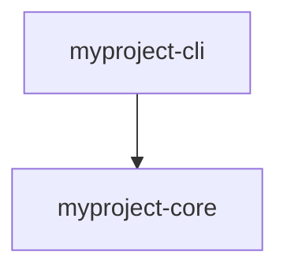

# Skill: write-architecture

> **When to invoke:** At the start of Phase 1, after `SPEC.md` is complete.
> Produces `ARCHITECTURE.md` from scratch or evaluates an existing draft.

---

## Execution Mode

This skill is run as a conversation, one step at a time. Present the step,
propose a design based on `SPEC.md`, ask the human to approve or revise,
and push back if the acceptance criteria are not met. Do not proceed to the
next step until the current step's output is accepted.

Unlike `write-spec` (which elicits requirements from the human),
`write-architecture` is collaborative: the agent proposes designs and the
human approves, rejects, or modifies. The human is not expected to invent
the architecture from scratch — but they must understand and accept every
decision.

**Fast path:** If the human provides a complete draft `ARCHITECTURE.md`,
evaluate it against every step's acceptance criteria and report which steps
pass and which need revision.

**Pre-requisite:** `SPEC.md` must exist and have passed the write-spec
review gate. Read it in full before starting.

---

## Procedure

### Step 1 — Crate map

Propose the crate decomposition. For each crate, state:

- **Name** — the crate name (e.g., `myproject-core`)
- **Type** — `bin` (produces a binary) or `lib` (library crate)
- **Responsibility** — one sentence describing what complexity this crate
  hides. If you cannot state the responsibility in one sentence, the crate
  is doing too much — split it.

Present the crate map as a table in this exact format (scaffold parses it):

```markdown
## Crate Map

| Crate | Type | Responsibility |
|---|---|---|
| myproject-cli | bin | CLI argument parsing and subcommand dispatch |
| myproject-core | lib | Core analysis engine |
```

**Design rules for the crate map:**

- The `bin` crate contains argument parsing and dispatch only. No business
  logic. This is non-negotiable.
- Every `lib` crate must hide significant complexity behind a narrow public
  API. A crate that merely re-exports types from another crate should not
  exist.
- Library crates do not depend on the CLI crate.
- Library crates do not depend on each other unless the dependency is
  necessary and directional (no circular dependencies).
- Start with fewer crates. Three well-designed crates are better than seven
  shallow ones. Propose the minimum set that satisfies the SPEC. The human
  can ask for more.

**Acceptance criteria:**
- Table uses the exact format shown above (three columns: Crate, Type,
  Responsibility)
- Exactly one `bin` crate, responsible for CLI dispatch only
- Every crate has a one-sentence responsibility that names what complexity
  it hides
- No crate's responsibility contains "and" linking two unrelated concerns
- Minimum viable number of crates — no speculative or "future-proofing"
  crates

### Step 2 — Dependency graph

Draw the dependency relationships between crates as a Mermaid diagram.
Every edge means "depends on" (the arrow points from dependent to
dependency).

```markdown
## Dependency Graph


```

**Design rules:**

- The CLI crate depends on library crates. Library crates never depend on
  the CLI crate.
- The dependency graph must be a DAG (directed acyclic graph). No cycles.
- Prefer shallow dependency trees. If crate A depends on B depends on C,
  ask whether A could depend on C directly instead.
- Every edge must be justified by an actual data flow — crate A calls a
  function in crate B, or uses a type defined in crate B.

**Acceptance criteria:**
- Valid Mermaid syntax that renders without errors
- Every crate from Step 1 appears in the graph
- No cycles
- CLI crate has only outgoing edges (depends on others), never incoming
- Every edge corresponds to a concrete need identified in SPEC.md

### Step 3 — Public API stubs

For each library crate, define the public API as concrete Rust function
signatures. These are the entry points that other crates call.

```markdown
## Public API Stubs

### myproject-core

```rust
/// Analyze the target codebase and return a structured report.
///
/// Returns `Err` if the path does not contain a valid Rust project.
pub fn analyze(path: &Path) -> Result<Report, CoreError>;
```
```

**Design rules:**

- Stubs must be concrete Rust: real types, real function names, real
  parameter types, real return types. "Takes a configuration and returns
  results" is not a stub.
- Every function signature includes a doc comment stating the contract:
  what it does, what it returns, when it fails.
- Error types are named (`CoreError`, not `Error`) and are crate-specific.
- Prefer functions that take `&Path` or `&str` over functions that take
  complex configuration structs — keep the entry point simple.
- Do not define internal types here. Only the types that cross crate
  boundaries: the public function parameters, return types, and error
  types.

**Acceptance criteria:**
- Every library crate has at least one public function with a concrete
  Rust signature
- Every function has a doc comment describing its contract
- Every return type is named (no anonymous tuples for public APIs)
- Every error type is crate-specific (not `anyhow::Error` in a library
  crate's public API)
- No function signature uses prose descriptions instead of Rust types

### Step 4 — Information hiding inventory

For each crate, state what internal complexity is hidden from callers.
This is the Ousterhout deep-module test: the crate's public API should
be much simpler than what happens inside.

```markdown
## Information Hiding Inventory

| Crate | Hides |
|---|---|
| myproject-core | AST parsing, file traversal, complexity scoring algorithms |
```

**Design rules:**

- If the "Hides" column is shorter than the "Responsibility" from Step 1,
  the crate is probably shallow — it's not hiding enough to justify its
  existence.
- If a crate's hidden complexity is "not much" or "just wraps X," it
  should be merged into another crate or eliminated.

**Acceptance criteria:**
- Every crate from Step 1 appears in the inventory
- Every "Hides" entry lists specific internal mechanisms, not vague
  categories
- No crate has a "Hides" entry that is shorter or less specific than its
  responsibility sentence

### Step 5 — Architectural Decision Records (ADRs)

For each major design choice — especially choices where a reasonable
alternative exists — write an ADR with three sections:

- **Context** — What problem or question prompted this decision?
- **Decision** — What was decided?
- **Consequences** — What are the trade-offs? What becomes easier and
  what becomes harder?

At minimum, write ADRs for:
- Why these crates and not fewer/more?
- Why this dependency direction?
- Any constraint from SPEC.md §7 that shapes the architecture (e.g.,
  "offline-only" drives the decision to avoid LLM dependencies)

```markdown
## ADR-001: Separate scan and visualization crates

**Context:** The tool both collects data and generates visual outputs.
These could live in one crate or two.

**Decision:** Separate into `myproject-scan` and `myproject-viz`.

**Consequences:** The visualization crate can be replaced or extended
without touching data collection. The cost is an additional crate
boundary and a serialization format between them.
```

**Acceptance criteria:**
- At least one ADR exists
- Every ADR has all three sections: Context, Decision, Consequences
- Consequences name at least one trade-off (something that becomes harder,
  not just benefits)
- No ADR restates a SPEC decision — ADRs are about *architectural*
  choices, not *product* choices

### Step 6 — Design checklist audit

Load `livery/standards/ousterhout.md` and run the Design Process Checklist
against the architecture defined in Steps 1–5. Record the result for each
checklist item.

If any item fails, revise the architecture before proceeding. Do not defer
design fixes to implementation.

**Acceptance criteria:**
- The checklist from `livery/standards/ousterhout.md` is run and results
  are recorded in ARCHITECTURE.md
- No checklist item is marked "will address later" — failures are fixed
  in the architecture now
- If a checklist item does not apply, state why

### Step 7 — Review gate

The architecture is complete when all sections exist AND the human has
confirmed:

- (a) Every crate hides significant complexity (the information hiding
  inventory is convincing)
- (b) The public API stubs are concrete enough to write tests against
- (c) The dependency graph has no unnecessary edges
- (d) The design checklist passes

If any of these fail, revise before proceeding to Phase 2.

**Acceptance criteria:**
- All six prior steps have accepted outputs
- The human has explicitly confirmed (a), (b), (c), and (d) above
- The final `ARCHITECTURE.md` is written to the project directory

---

## Output Format

The final `ARCHITECTURE.md` must contain all sections in this order:

1. Crate Map (table format from Step 1)
2. Dependency Graph (Mermaid diagram from Step 2)
3. Public API Stubs (per-crate Rust signatures from Step 3)
4. Information Hiding Inventory (table from Step 4)
5. ADRs (numbered, from Step 5)
6. Design Checklist Audit (results from Step 6)

The Crate Map table format is mandatory — `livery/bin/scaffold` parses it
to generate the workspace. Use the exact three-column format:
`| Crate | Type | Responsibility |`

---

## Stopping Condition

The skill is complete when `ARCHITECTURE.md` exists in the project
directory, all seven steps have been accepted, and the human has confirmed
the review gate.